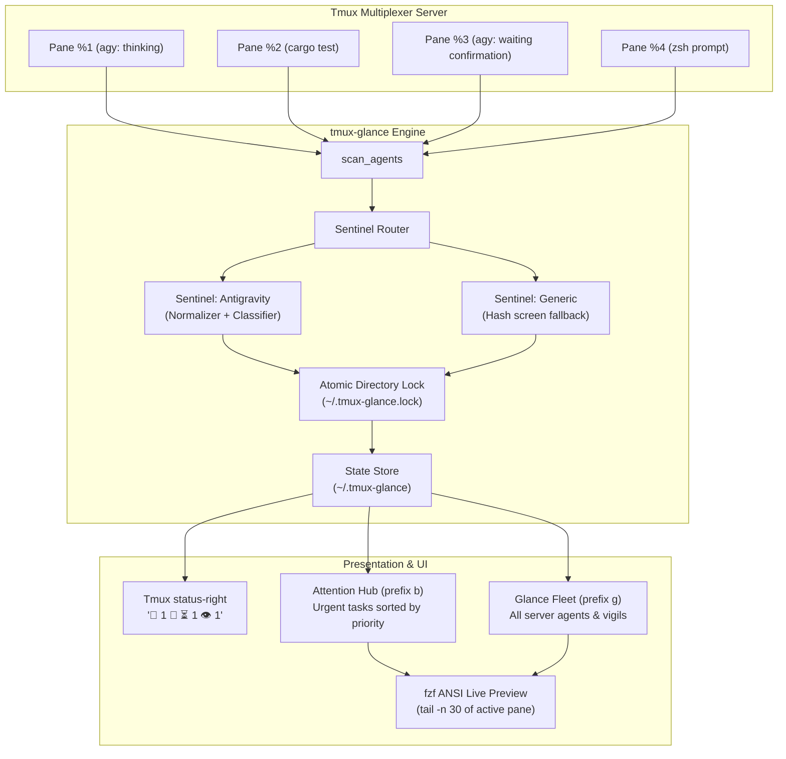

# System Architecture: `tmux-glance`

**Ambient Terminal Sentinels & Background Agent Orchestration for Tmux**  
*Status: Approved & Implemented (v3.0)*  
*Target: Standalone Open-Source Project (`github:mhutchinson/tmux-glance`)*

---

## 1. Executive Summary

As terminal workflows transition from synchronous shell commands to autonomous, long-running processes—such as background AI coding agents (Antigravity, Claude Code, Aider), compilation pipelines (`cargo build`, `nix build`), remote database syncs, and test suites—developers suffer from chronic **speculative window hopping**: cycling through tmux windows and panes simply to inspect whether a process has completed, failed, or blocked waiting for user input.

`tmux-glance` eliminates speculative hopping by establishing an **ambient status-right telemetry protocol**, an on-demand **Attention Hub** (`prefix b`), a server-wide **Glance Fleet View** (`prefix g`), and instant single-pane **Vigil watches** (`prefix v`).

---

## 2. Core Philosophy & Architectural Invariants

1. **Glanceable by Default:** Ambient status-right cues (`🚨 1`, `🤖 ⏳ 1`, `🤖 ✓ 1`, `👁️ 2`) convey server-wide state at the edge of the developer's vision. If the status bar is quiet, zero action is required.
2. **Minimally Invasive by Default:** Designed to drop into mature, existing tmux setups with zero namespace collision.
   * Only registers non-disruptive core bindings by default (`prefix g`, `prefix b`, `prefix v`).
   * Never hijacks standard tmux defaults (especially `prefix [` copy-mode, or `c`, `z`, `n`, `p`).
   * Direct navigation chords, jumplist rewinds, and quickfix cycling are strictly Tier 2 opt-ins (`@glance_enable_*`).
   * Interactive search keys (`Ctrl-b`, `Ctrl-s`, `Ctrl-h`, `Enter`) stay strictly scoped inside the `fzf` popup subprocess.
3. **Sub-50ms Status Bar Execution Budget:** `tmux-glance status` runs synchronously inside `status-right` on tmux's `status-interval`. It must execute in `< 50ms`. Zero network requests or heavy subshell pipelines are permitted. All external telemetry (such as API quotas or saturation gauges) must read pre-warmed local cache files written asynchronously out-of-band.
4. **Pluggable Sentinels:** Agent TUIs and process monitors are decoupled behind a clean, pluggable Sentinel interface (`matches`, `classify`, `fingerprint`), enabling modular support for diverse agents without core multiplexer entanglement.
5. **Intelligent Thought & Spinner Normalization:** Sentinels strip transient visual noise—such as animated braille spinners (`[⣟⣯⣷]`) and streaming thought indicators—before computing buffer fingerprints, eliminating false-positive unread alarms.
6. **Zero-Friction Auto-Acknowledgment & Dwell Protection:** Merely switching focus into an alerted pane acknowledges and clears the alert. However, rapid cycling or navigation across panes must suppress auto-acknowledgment until dwell time expires, preventing accidental clearing of unread alerts while whizzing past.
7. **Rock-Solid Concurrency & Atomicity:** Atomic directory locking (`.lock` via `mkdir`) and temporary file renames (`mv`) protect state across concurrent tmux status redraws, window switches, and hook triggers.
8. **Cross-Platform POSIX Portability:** Scripts and tests run seamlessly on Darwin (macOS BSD coreutils, `md5`) and Linux (GNU coreutils, `md5sum`).


---

## 3. High-Level Architecture & Component Flow



---

## 4. The Pluggable Sentinel Architecture

Pane monitoring logic is decoupled into modular Sentinel shell modules located in `sentinels/*.sh` or user configuration (`~/.config/tmux-glance/sentinels/*.sh`).

### Sentinel Contract

Every Sentinel implements three functions:

```bash
# 1. Matcher: Returns 0 if this sentinel handles the given command name
sentinel_<name>_matches() {
    local cmd="$1"
    ...
}

# 2. Classifier: Returns tab-delimited "state\tlabel"
#    States: waiting | running | done | idle | unknown
sentinel_<name>_classify() {
    local pane_id="$1" path="$2" cmd="$3"
    ...
}

# 3. Fingerprint: Outputs an MD5 hash of the normalized visible buffer
sentinel_<name>_fingerprint() {
    local pane_id="$1"
    ...
}
```

### In-Scope Sentinels

#### 1. `sentinel-antigravity`
* **Matcher:** `cmd =~ ^(agy|antigravity)$`
* **Classification:**
  * `WAITING`: Detects interactive permission prompts (`Requesting permission for`, `Run this command?`, `Navigate · tab Amend`, `1. Yes, run command`, `(y/n)`).
  * `RUNNING`: Detects active execution (`esc to cancel`).
  * `IDLE`: Detects resting prompt (`? for shortcuts`).
* **Thinking Spinner Normalizer:**
  Antigravity streams thoughts and animates braille spinners (`[⠋⠙⠹⠸⠼⠴⠦⠧⠇⠏⣾⣽⣻⢿⡿⣟⣯⣷]`) in-place during thinking blocks. The normalizer strips these lines before hashing:
  ```bash
  sentinel_antigravity_fingerprint() {
      local pane_id="$1"
      tmux capture-pane -p -t "$pane_id" 2>/dev/null \
          | grep -vE '^[[:space:]]*[⠋⠙⠹⠸⠼⠴⠦⠧⠇⠏⣾⣽⣻⢿⡿⣟⣯⣷][[:space:]]' \
          | sed -E 's/Thinking\.\.\..*//' \
          | (md5 -q 2>/dev/null || md5sum 2>/dev/null | cut -d' ' -f1 || cksum | cut -d' ' -f1)
  }
  ```

#### 2. `sentinel-generic`
* **Matcher:** Fallback for all other commands (`bash`, `zsh`, `cargo`, `git`, `python`, etc.).
* **Classification:** Returns `watching` or `alert` based on screen fingerprint divergence.
* **Fingerprint:** Raw visible buffer MD5 hash.

### Third-Party Sentinels (e.g. Claude CLI)
* Explicitly marked as non-core community contribution targets. Any contributor can implement `sentinels/claude.sh` conforming to the Sentinel Contract.

---

## 5. State Management & Invariant Engine

### State File Schema (`~/.tmux-glance`)
Tab-delimited flat file:
```
pane_id	session_name	window_index	pane_index	current_path	current_command	label	kind	state
```
* **kind:** `auto` (ephemeral autonomous agent) or `manual` (explicit user Vigil).
* **state:** `waiting`, `running`, `done`, `watching`, `alert`.

### Asynchronous Idle Agent Hashing Contract
Autonomous agents frequently drop back to the prompt (`? for shortcuts`) while background subagents or commands run. Capturing the footer alone misses newly appended tool logs.
1. Idle agents have their screen fingerprinted into `@glance_agent_snapshot`.
2. While the agent pane is in the background, if `curr_hash != @glance_agent_snapshot`, it indicates unread terminal activity.
3. The agent immediately transitions to `done` ("updated in <repo>") and enters the Attention Hub queue.
4. Focusing the pane (`on_focus`) updates the snapshot, acknowledges the activity, and silences the alert.

### Atomic Directory Locking
To prevent corrupt writes or race conditions between tmux's periodic `status-right` scan (every 5 seconds) and interactive commands:
```bash
acquire_lock() {
    local lock_dir="${STATE_FILE}.lock"
    local count=0
    while ! mkdir "$lock_dir" 2>/dev/null; do
        sleep 0.02
        count=$((count + 1))
        if [[ $count -ge 50 ]]; then
            rmdir "$lock_dir" 2>/dev/null || true
            count=0
        fi
    done
}
```

---

## 6. Ergonomics & Tiered Keybinding Architecture

To respect established tmux environments and prevent keybinding namespace pollution, `tmux-glance` enforces a strict **Two-Tier Keybinding Policy**:

### Tier 1: Core Non-Contentious Bindings (Enabled by Default)
Only binds dedicated, non-disruptive keys. Preserves all standard tmux navigation, copy-mode, and window management:

| Keybinding | Scope | Purpose |
| :--- | :--- | :--- |
| `prefix g` | Global | **Glance Mode:** Server-wide Fleet View of all running agents and vigils. |
| `prefix b` | Global | **Attention Hub:** Urgent queue (waiting prompts, completed runs, alerts). |
| `prefix v` | Global | **Vigil Toggle:** Instantly watch/unwatch current pane for output. |
| `Ctrl-b` | *Popup only* | **Toggle View:** Flip between Attention Hub and Glance Fleet inside fzf. |
| `Enter` | *Popup only* | **Jump:** Instantly switch client, window, and pane to target. |

### Tier 2: Power-User & Direct Navigation (Strictly Opt-In)
Global navigation chords, jumplist rewinds, and queue cycling can collide with personal shortcuts (e.g. tmux's default `[` for copy-mode or custom window switchers). These are **disabled by default** and require explicit opt-in:

| Keybinding | Scope | Feature | Config Option |
| :--- | :--- | :--- | :--- |
| `prefix C-z` / `prefix C-y` | Global | **Jumplist Undo/Redo** (v0.8) | `@glance_enable_jumplist 'on'` |
| `prefix -r u` / `prefix -r U` | Global | **Repeatable History Walk** (v0.8) | `@glance_enable_jumplist 'on'` |
| `prefix -r ]` / `prefix -r [` | Global | **Quickfix Alert Cycling** (v0.10) | `@glance_enable_quickfix 'on'` |

*Note: Users who do not opt into Tier 2 bindings still have 100% access to history and navigation features from inside the popup dashboard (`Ctrl-h`, `Ctrl-s`, `Ctrl-w`, etc.) without polluting their global prefix table.*

---

## 7. Design Evolution Log

* **v3.0 Standalone Project Extraction (`tmux-glance`):**
  - Formalized as standalone flake and TPM package.
  - Pluggable Sentinel architecture introduced with thinking spinner normalizer.
  - Migrated `prefix B` to `prefix v` (Vigil) for an all-unshifted left-hand navigation cluster (`s`, `f`, `g`, `b`, `v`).
* **v2.4 Dynamic Output Alarms & Sentinels:**
  - Introduced output hashing to upgrade quiet watches to `🚨 Alert` on background output.
* **v2.0 Dual-View Navigation & Agent Attention Hub:**
  - Added background autonomous agent scraping, fzf live previews, and dual-mode toggle.
* **v1.0 Basic Tmux Bookmarks:**
  - Initial pinned pane bookmarks with fzf switcher.

---

## 8. Future Roadmap & Explorations

* **In-Dashboard Sessionizer (`Ctrl-s` in fzf):**
  - Integrate session navigation directly into the Glance popup.
  - List and search all active tmux sessions with live status summaries (displaying the exact badge icons that would appear in `status-right` for each session, e.g. `🚨 1`, `🤖 ⏳ 1`, `👁️ 2`).
  - Allows 1-keystroke teleportation across entire workspaces without needing a separate sessionizer binding.
* **Hierarchy Telescoping (`Ctrl-w` / `Ctrl-p`):**
  - Quick-switch views to search across all open windows (`Ctrl-w`) or all active panes (`Ctrl-p`) across the server, transforming Glance into a universal tmux teleporter.
* **Jump History & Backtracking Jumplist (`Ctrl-h` / Undo-Redo):**
  - Maintain a dual back/forward traversal stack (`jump-back` / `jump-forward`) similar to Vim's `<C-o>` / `<C-i>` or browser navigation:
    - **Normal Jump:** Push source pane to Back stack, clear Forward stack, switch to destination.
    - **Jump Back (Undo):** Pop target from Back stack, push current pane to Forward stack, switch to target.
    - **Jump Forward (Redo):** Pop target from Forward stack, push current pane to Back stack, switch to target.
    - **Liveness Invariant:** Silently discard stale/dead panes when popping before switching.
  - **Instant Keyboard Traversal (Tier 2 Opt-in, No Menu Required):**
    - `prefix C-z` (Undo) & `prefix C-y` / `prefix C-Z` (Redo) for instant single-chord backtracking (safely replacing the dangerous default tmux `suspend-client` on `C-z`).
    - Repeatable bindings via `bind-key -r u` (Undo) and `bind-key -r U` (Redo), allowing multi-hop rewinds by tapping `u u u` within the tmux `repeat-time` window without re-pressing `prefix`.
  - **Visual Traversal Inspector (`Ctrl-h` in fzf):** Pressing `Ctrl-h` within the Glance popup opens a chronological list of recent jump locations with live previews.
* **Global Agent Quotas & Saturation Gauges (`sentinel_<name>_gauge`):**
  - Allow sentinels to optionally contribute a single, global capacity or quota gauge (e.g. LLM API token quota, hourly request limits, or harness saturation).
  - **Threshold Visibility Rule:** Quota gauges only appear in `status-right` when depleted below **20%** (e.g. `#[fg=#fab387]🪫 18%#[default]`, escalating to `#[fg=#f38ba8,bold]⚠️ 4%#[default]`). When >20%, `status-right` remains completely quiet and uncluttered.
  - **Always Visible in Dashboard:** The Glance Fleet View (`prefix g` / `prefix b`) always displays the gauge in the header/telemetry bar regardless of level so developers can check capacity at any time.
  - **Strictly Global (No Per-Pane Churn):** Limit of 1 global gauge per harness. Progress bars or multi-terminal metrics are disallowed in this slot to prevent status bar churn and visual clutter.
  - **Asynchronous Local Cache Invariant:** Gauges must **never** make synchronous HTTP or CLI queries inside `status-right` polling (must read a local cache file written out-of-band by a daemon, hook, or background task to preserve the <50ms status budget). Pilot with `sentinel_antigravity` first.
* **Quickfix Attention Cycling & Queue HUD (`prefix -r ]` / `prefix -r [`):**
  - Instant Vim-quickfix-style navigation (`:cnext` / `:cprev`) cycling through all panes currently contributing active icons to `status-right`.
  - **Strict Deterministic Queue Ordering:**
    1. *Primary Sort (Severity Rank):* Alerts (`🚨`) > Blocked Agents (`🤖 ⏳`) > Finished Tasks (`🤖 ✓`).
    2. *Secondary Tie-Breaker:* Stable ordering by state timestamp (oldest pending prompt first) or server pane hierarchy (`session:window.pane`) to ensure predictable muscle memory.
  - **Repeatable Keybindings (Tier 2 Opt-in via `-r`):**
    - `prefix -r ]` — Jump to next attention item.
    - `prefix -r [` — Jump to previous attention item.
    - Rapid tapping (e.g. `prefix ] ] ]`) allows whizzing across multiple items within tmux's `repeat-time` window without re-pressing `prefix`.
  - **Visual Queue HUD & Progress Feedback:**
    - Avoids spatial disorientation during rapid jumps:
      - *Top-Right Floating HUD:* A mini-popup docked at the top-right corner (`-x R -y 0`) showing the mini-queue with an active cursor:
        ```text
        ┌ Attention Queue (2/3) ┐
        │ 1. 🚨 cargo test       │
        │>2. 🤖 ⏳ agy prompt    │
        │ 3. 🤖 ✓ backend auth   │
        └────────────────────────┘
        ```
      - *Status Bar Override:* Alternatively, temporarily override `status-right` or flash a tmux message: `[2/3] 🤖 ⏳ agy (nix-home) "permission required" — [ / ] to cycle`.
  - **Dwell-Time Auto-Ack Protection ("The Whiz-Past Invariant"):**
    - Rapidly stepping past panes suppresses the `pane-focus-in` auto-acknowledgment hook.
    - An alert is only cleared once cycling ceases (repeatable timer expires and user remains dwell-focused on the pane) or upon explicit user interaction in the pane, preventing accidental dismissal of unread alerts.


