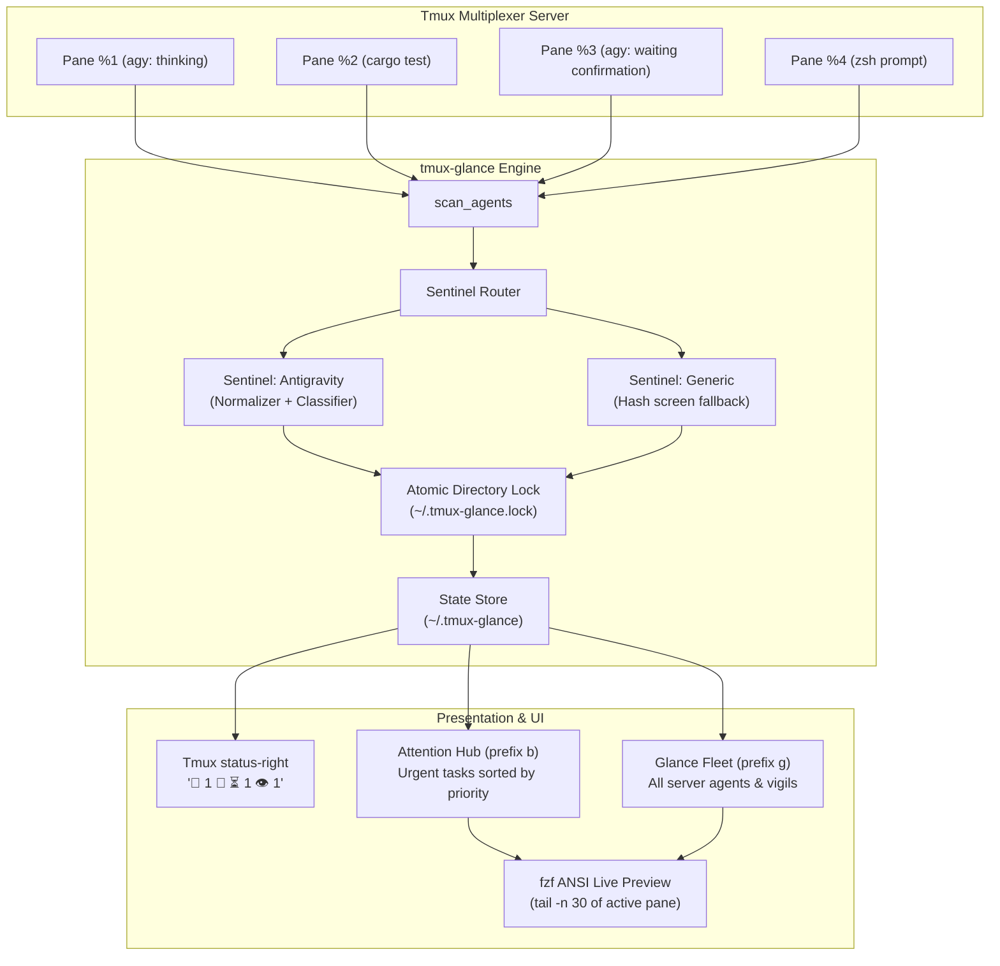

# System Architecture: `tmux-glance`

**Ambient Terminal Sentinels & Background Agent Orchestration for Tmux**  
*Status: Approved & Implemented (v3.0)*  
*Target: Standalone Open-Source Project (`github:mhutchinson/tmux-glance`)*

---

## 1. Executive Summary

As terminal workflows transition from synchronous shell commands to autonomous, long-running processes—such as background AI coding agents (Antigravity, Claude Code, Aider), compilation pipelines (`cargo build`, `nix build`), remote database syncs, and test suites—developers suffer from chronic **speculative window hopping**: cycling through tmux windows and panes simply to inspect whether a process has completed, failed, or blocked waiting for user input.

`tmux-glance` eliminates speculative hopping by establishing an **ambient status-right telemetry protocol**, an on-demand **Attention Hub** (`prefix b`), a server-wide **Glance Fleet View** (`prefix g`), and instant single-pane **Vigil watches** (`prefix v`).

---

## 2. Core Philosophy & Invariants

1. **Glanceable by Default:** Ambient status-right cues (`🚨 1`, `🤖 ⏳ 1`, `🤖 ✓ 1`, `👁️ 2`) convey server-wide state at the edge of the developer's vision. If the status bar is quiet, zero action is required.
2. **Pluggable Sentinels:** Agent TUIs and process monitors are decoupled behind a clean, pluggable Sentinel interface (`matches`, `classify`, `fingerprint`), enabling modular support for diverse agents without core multiplexer entanglement.
3. **Intelligent Normalization:** Sentinels strip transient visual noise—such as animated braille spinners (`[⣟⣯⣷]`) and streaming thought indicators—before computing buffer fingerprints, eliminating false-positive unread alarms.
4. **Zero-Friction Auto-Acknowledgment:** Merely switching focus to a finished agent or an alerting pane acknowledges the event, updates the baseline fingerprint, and clears the alert.
5. **Rock-Solid Concurrency:** Atomic directory locking (`.lock`) protects state across concurrent tmux status redraws, window switches, and hook triggers.

---

## 3. High-Level Architecture & Component Flow



---

## 4. The Pluggable Sentinel Architecture

Pane monitoring logic is decoupled into modular Sentinel shell modules located in `sentinels/*.sh` or user configuration (`~/.config/tmux-glance/sentinels/*.sh`).

### Sentinel Contract

Every Sentinel implements three functions:

```bash
# 1. Matcher: Returns 0 if this sentinel handles the given command name
sentinel_<name>_matches() {
    local cmd="$1"
    ...
}

# 2. Classifier: Returns tab-delimited "state\tlabel"
#    States: waiting | running | done | idle | unknown
sentinel_<name>_classify() {
    local pane_id="$1" path="$2" cmd="$3"
    ...
}

# 3. Fingerprint: Outputs an MD5 hash of the normalized visible buffer
sentinel_<name>_fingerprint() {
    local pane_id="$1"
    ...
}
```

### In-Scope Sentinels

#### 1. `sentinel-antigravity`
* **Matcher:** `cmd =~ ^(agy|antigravity)$`
* **Classification:**
  * `WAITING`: Detects interactive permission prompts (`Requesting permission for`, `Run this command?`, `Navigate · tab Amend`, `1. Yes, run command`, `(y/n)`).
  * `RUNNING`: Detects active execution (`esc to cancel`).
  * `IDLE`: Detects resting prompt (`? for shortcuts`).
* **Thinking Spinner Normalizer:**
  Antigravity streams thoughts and animates braille spinners (`[⠋⠙⠹⠸⠼⠴⠦⠧⠇⠏⣾⣽⣻⢿⡿⣟⣯⣷]`) in-place during thinking blocks. The normalizer strips these lines before hashing:
  ```bash
  sentinel_antigravity_fingerprint() {
      local pane_id="$1"
      tmux capture-pane -p -t "$pane_id" 2>/dev/null \
          | grep -vE '^[[:space:]]*[⠋⠙⠹⠸⠼⠴⠦⠧⠇⠏⣾⣽⣻⢿⡿⣟⣯⣷][[:space:]]' \
          | sed -E 's/Thinking\.\.\..*//' \
          | (md5 -q 2>/dev/null || md5sum 2>/dev/null | cut -d' ' -f1 || cksum | cut -d' ' -f1)
  }
  ```

#### 2. `sentinel-generic`
* **Matcher:** Fallback for all other commands (`bash`, `zsh`, `cargo`, `git`, `python`, etc.).
* **Classification:** Returns `watching` or `alert` based on screen fingerprint divergence.
* **Fingerprint:** Raw visible buffer MD5 hash.

### Third-Party Sentinels (e.g. Claude CLI)
* Explicitly marked as non-core community contribution targets. Any contributor can implement `sentinels/claude.sh` conforming to the Sentinel Contract.

---

## 5. State Management & Invariant Engine

### State File Schema (`~/.tmux-glance`)
Tab-delimited flat file:
```
pane_id	session_name	window_index	pane_index	current_path	current_command	label	kind	state
```
* **kind:** `auto` (ephemeral autonomous agent) or `manual` (explicit user Vigil).
* **state:** `waiting`, `running`, `done`, `watching`, `alert`.

### Asynchronous Idle Agent Hashing Contract
Autonomous agents frequently drop back to the prompt (`? for shortcuts`) while background subagents or commands run. Capturing the footer alone misses newly appended tool logs.
1. Idle agents have their screen fingerprinted into `@glance_agent_snapshot`.
2. While the agent pane is in the background, if `curr_hash != @glance_agent_snapshot`, it indicates unread terminal activity.
3. The agent immediately transitions to `done` ("updated in <repo>") and enters the Attention Hub queue.
4. Focusing the pane (`on_focus`) updates the snapshot, acknowledges the activity, and silences the alert.

### Atomic Directory Locking
To prevent corrupt writes or race conditions between tmux's periodic `status-right` scan (every 5 seconds) and interactive commands:
```bash
acquire_lock() {
    local lock_dir="${STATE_FILE}.lock"
    local count=0
    while ! mkdir "$lock_dir" 2>/dev/null; do
        sleep 0.02
        count=$((count + 1))
        if [[ $count -ge 50 ]]; then
            rmdir "$lock_dir" 2>/dev/null || true
            count=0
        fi
    done
}
```

---

## 6. Ergonomics & Keybinding Hierarchy

| Keybinding | Action | Purpose |
| :--- | :--- | :--- |
| `prefix g` | **Glance Mode** | Server-wide Fleet View of all running agents and vigils. |
| `prefix b` | **Attention Hub** | Urgent queue (waiting prompts, completed runs, alerts). |
| `prefix v` | **Vigil Toggle** | Instantly watch/unwatch the current pane for terminal output. |
| `Ctrl-b` *(in fzf)* | **Toggle View** | Flip between Attention Hub and Glance Fleet dynamically. |
| `Enter` *(in fzf)* | **Jump** | Instantly switch client, window, and pane to target. |

---

## 7. Design Evolution Log

* **v3.0 Standalone Project Extraction (`tmux-glance`):**
  - Formalized as standalone flake and TPM package.
  - Pluggable Sentinel architecture introduced with thinking spinner normalizer.
  - Migrated `prefix B` to `prefix v` (Vigil) for an all-unshifted left-hand navigation cluster (`s`, `f`, `g`, `b`, `v`).
* **v2.4 Dynamic Output Alarms & Sentinels:**
  - Introduced output hashing to upgrade quiet watches to `🚨 Alert` on background output.
* **v2.0 Dual-View Navigation & Agent Attention Hub:**
  - Added background autonomous agent scraping, fzf live previews, and dual-mode toggle.
* **v1.0 Basic Tmux Bookmarks:**
  - Initial pinned pane bookmarks with fzf switcher.

---

## 8. Future Roadmap & Explorations

* **In-Dashboard Sessionizer (`Ctrl-s` in fzf):**
  - Integrate session navigation directly into the Glance popup.
  - List and search all active tmux sessions with live status summaries (displaying the exact badge icons that would appear in `status-right` for each session, e.g. `🚨 1`, `🤖 ⏳ 1`, `👁️ 2`).
  - Allows 1-keystroke teleportation across entire workspaces without needing a separate sessionizer binding.
* **Hierarchy Telescoping (`Ctrl-w` / `Ctrl-p`):**
  - Quick-switch views to search across all open windows (`Ctrl-w`) or all active panes (`Ctrl-p`) across the server, transforming Glance into a universal tmux teleporter.
* **Jump History & Backtracking (`Ctrl-h`):**
  - Maintain a jump history stack recording the source pane whenever a user teleports via Glance.
  - Pressing `Ctrl-h` within the viewer or via shortcut walks backwards through jump history, allowing effortless round-trip navigation back to where you were working.
