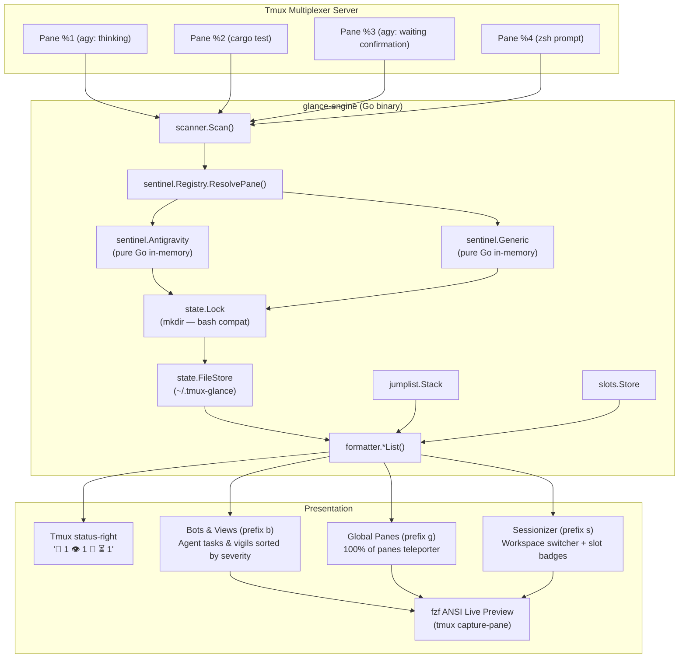

# System Architecture: `tmux-glance`

**Ambient Terminal Sentinels & Background Agent Orchestration for Tmux**  
*Status: Approved & Implemented (v0.7 — Go engine)*  
*Target: Standalone Open-Source Project (`github:mhutchinson/tmux-glance`)*

---

## 1. Executive Summary

As terminal workflows transition from synchronous shell commands to autonomous, long-running processes—such as background AI coding agents (Antigravity, Claude Code, Aider), compilation pipelines (`cargo build`, `nix build`), remote database syncs, and test suites—developers suffer from chronic **speculative window hopping**: cycling through tmux windows and panes simply to inspect whether a process has completed, failed, or blocked waiting for user input.

`tmux-glance` eliminates speculative hopping by establishing an **ambient status-right telemetry protocol**, an on-demand **Bots & Views** viewfinder (`prefix b`), a server-wide **Global Panes Go-To teleporter** (`prefix g`), and instant single-pane **Vigil watches** (`prefix v`).

---

## 2. Core Philosophy & Architectural Invariants

1. **Glanceable by Default (User-First Domain Clustering):** Ambient status-right cues (`🚨 1`, `👁️ 2`, `🤖 ⏳ 1`, `🤖 ⚡ 2`, `🤖 ✓ 1`) convey server-wide state at the edge of the developer's vision. To put the developer first, manual user vigils (`🚨`, `👁️`) are clustered on the left, followed by autonomous background agents (`🤖 ⏳`, `🤖 ⚡`, `🤖 ✓`) on the right. If the status bar is quiet, zero action is required.
2. **Minimally Invasive by Default:** Designed to drop into mature, existing tmux setups with zero namespace collision.
   * Only registers non-disruptive core bindings by default (`prefix g`, `prefix b`, `prefix v`).
   * Never hijacks standard tmux defaults (especially `prefix [` copy-mode, or `c`, `z`, `n`, `p`).
   * Direct navigation chords, jumplist rewinds, and quickfix cycling are strictly Tier 2 opt-ins (`@glance_enable_*`).
   * Interactive search keys (`Ctrl-b`, `Ctrl-s`, `Ctrl-h`, `Enter`) stay strictly scoped inside the `fzf` popup subprocess.
3. **Sub-50ms Status Bar Execution Budget:** `tmux-glance status` runs synchronously inside `status-right` on tmux's `status-interval`. It must execute in `< 50ms`. Non-candidate panes (standard shells/compilations without active vigils) are bypassed immediately in O(1) time without capture-pane or hashing subprocesses. Candidate agent panes and vigils are evaluated concurrently across parallel worker subshells, and background scans are debounced via a configurable cooldown threshold (`@glance_scan_cooldown`). All external telemetry (such as API quotas or saturation gauges) must read pre-warmed local cache files written asynchronously out-of-band.
4. **Pluggable Sentinels:** Agent TUIs and process monitors are decoupled behind a clean, pluggable Sentinel interface (`matches`, `classify`, `fingerprint`), enabling modular support for diverse agents without core multiplexer entanglement.
5. **Intelligent Thought & Spinner Normalization:** Sentinels strip transient visual noise—such as animated braille spinners (`[⣟⣯⣷]`) and streaming thought indicators—before computing buffer fingerprints, eliminating false-positive unread alarms.
6. **Zero-Friction Auto-Acknowledgment:** Merely switching focus into an alerted pane acknowledges and clears the alert. (Note: Rapid navigation dwell-time suppression to protect unread alerts while cycling past is scheduled for milestone v0.8 alongside quickfix cycling).
7. **Rock-Solid Concurrency & Atomicity:** Atomic directory locking (`.lock` via `mkdir`) and temporary file renames (`mv`) protect state across concurrent tmux status redraws, window switches, and hook triggers.
8. **Cross-Platform POSIX Portability:** Scripts and tests run seamlessly on Darwin (macOS BSD coreutils, `md5`) and Linux (GNU coreutils, `md5sum`).


---

## 3. High-Level Architecture & Component Flow

As of v0.7, all stateful engine logic has moved to **`glance-engine`**, a compiled Go binary. The bash script (`bin/tmux-glance`) is now a thin ~140-line dispatcher handling only FZF popup assembly, preview loops, and key-read interactions.

### Go/Bash Boundary

```
┌─────────────────────────────────────────────────────────────────┐
│  bin/tmux-glance  (bash, ~140 lines)                            │
│  • fzf popup launcher (list / list-all / list-sessions / history)│
│  • preview_pane loop (background tail via tmux capture-pane)     │
│  • pin_interactive (raw key read for Harpoon slot assignment)    │
│  • cheat_sheet (static printf)                                   │
│  Everything else: exec glance-engine "$@"                        │
└──────────────────────────┬──────────────────────────────────────┘
                           │ exec / subprocess
┌──────────────────────────▼──────────────────────────────────────┐
│  glance-engine  (Go binary)                                     │
│                                                                 │
│  cmd/glance-engine/main.go   ← thin arg dispatch               │
│  internal/                                                      │
│    tmux/       typed pane/session queries; process tree inspect │
│    state/      FileStore (atomic writes), bash-compat Lock      │
│    sentinel/   native Go sentinels (antigravity, generic)       │
│    scanner/    goroutine fan-out (pool=8), Scan/OnFocus/Status  │
│    jumplist/   back/forward stacks; ShiftTo() fixes Issue #2    │
│    slots/      Harpoon slot store                               │
│    formatter/  FZF line renderers (attention/all/sessions/hist) │
└─────────────────────────────────────────────────────────────────┘
```

### Data Flow Diagram




## 4. The Sentinel Architecture

Pane monitoring logic is implemented via modular `sentinel.Sentinel` implementations in `internal/sentinel/`. First-class sentinels (`antigravity`, `generic`) run in pure Go in-memory with zero subprocess forks.

### Sentinel Contract

Every Sentinel implements the `sentinel.Sentinel` interface:

```go
type Sentinel interface {
	Name() string
	Matches(pane tmux.PaneInfo) bool
	Classify(ctx context.Context, pane tmux.PaneInfo, buffer string) (Classification, error)
	Fingerprint(ctx context.Context, pane tmux.PaneInfo, buffer string) (string, error)
}
```

#### Process Tree Inspection (Issue #3)
Sentinels receive the full `tmux.PaneInfo`, including `pane.PID` (retrieved via `#{pane_pid}` in a single batched `list-panes` call).
When command names are generic wrappers (e.g. `cli`, `agent`, `run`), `Matches(pane)` invokes `tmux.InspectProcessTree(ctx, pane.PID)` to inspect process command lines (reading `/proc/<pid>/cmdline` on Linux or `ps` on macOS), disambiguating agent processes from unrelated CLIs without requiring manual `@glance_routes` overrides.

### In-Scope Sentinels

#### 1. `sentinel-antigravity`
* **Matcher:** `cmd =~ ^(agy|antigravity)$`
* **Classification:**
  * `WAITING`: Detects interactive permission prompts, subagent approval requests, and blocked tool execution (`needs approval`, `ctrl+y approve`, `Blocked ·`, `Requesting permission for`, `Run this command?`, `Navigate · tab Amend`, `1. Yes, run command`, `(y/n)`).
  * `RUNNING`: Detects active execution (`esc to cancel`).
  * `IDLE`: Detects resting prompt (`? for shortcuts`). Note that `WAITING` cues take precedence over `IDLE`, as the footer resting prompt (`? for shortcuts`) remains visible while subagents are blocked waiting for approval.
* **Thinking Spinner Normalizer:**
  Antigravity streams thoughts and animates braille spinners (`[⠋⠙⠹⠸⠼⠴⠦⠧⠇⠏⣾⣽⣻⢿⡿⣟⣯⣷]`) in-place during thinking blocks. The normalizer strips these lines before hashing:
  ```bash
  sentinel_antigravity_fingerprint() {
      local pane_id="$1"
      tmux capture-pane -p -t "$pane_id" 2>/dev/null \
          | grep -vE '^[[:space:]]*[⠋⠙⠹⠸⠼⠴⠦⠧⠇⠏⣾⣽⣻⢿⡿⣟⣯⣷][[:space:]]' \
          | sed -E 's/Thinking\.\.\..*//' \
          | (md5 -q 2>/dev/null || md5sum 2>/dev/null | cut -d' ' -f1 || cksum | cut -d' ' -f1)
  }
  ```

#### 2. `sentinel-generic`
* **Matcher:** Fallback for all other commands (`bash`, `zsh`, `cargo`, `git`, `python`, etc.).
* **Classification:** Returns `watching` or `alert` based on screen fingerprint divergence.
* **Fingerprint:** Raw visible buffer MD5 hash.

### Third-Party Sentinels (e.g. Claude CLI)
* Explicitly marked as non-core community contribution targets. Any contributor can implement `sentinels/claude.sh` conforming to the Sentinel Contract.

---

## 5. State Management & Invariant Engine

### State File Schema (`~/.tmux-glance`)
Tab-delimited flat file:
```
pane_id	session_name	window_index	pane_index	current_path	current_command	label	kind	state
```
* **kind:** `auto` (ephemeral autonomous agent) or `manual` (explicit user Vigil).
* **state:** `waiting`, `running`, `done`, `watching`, `alert`.

### Asynchronous Idle Agent Hashing Contract
Autonomous agents frequently drop back to the prompt (`? for shortcuts`) while background subagents or commands run. Capturing the footer alone misses newly appended tool logs.
1. Idle agents have their screen fingerprinted into `@glance_agent_snapshot`.
2. While the agent pane is in the background, if `curr_hash != @glance_agent_snapshot`, it indicates unread terminal activity.
3. The agent immediately transitions to `done` ("updated in <repo>") and enters the Attention Hub queue.
4. Focusing the pane (`on_focus`) updates the snapshot, acknowledges the activity, and silences the alert.

### Atomic Directory Locking
To prevent corrupt writes or race conditions between tmux's periodic `status-right` scan (every 5 seconds) and interactive commands:
```bash
acquire_lock() {
    local lock_dir="${STATE_FILE}.lock"
    local count=0
    while ! mkdir "$lock_dir" 2>/dev/null; do
        sleep 0.02
        count=$((count + 1))
        if [[ $count -ge 50 ]]; then
            rmdir "$lock_dir" 2>/dev/null || true
            count=0
        fi
    done
}
```

### Harpoon Session Slots (`~/.local/state/tmux-glance/slots`)
To enable instantaneous, 1-chord teleportation across developer projects without hardcoding cryptic session names (like `0`, `J`, `K`, `L`), `tmux-glance` provides a dynamic Harpoon slot engine.
* **Storage Schema:** Tab-delimited flat file: `<slot>\t<session_name>` (e.g. `j\tnix-home`). Stored under `$XDG_STATE_HOME/tmux-glance/slots`.
* **Zero Config Drag:** Slots are assigned dynamically without editing Nix or shell environment variables. Survives reboots and works seamlessly with `tmux-resurrect`.
* **Modal Assignment:** Slots are managed directly inside the Sessionizer (`Ctrl-s`) by pressing `Ctrl-p` on any highlighted session, avoiding global key namespace clutter.

---

## 6. Ergonomics & Tiered Keybinding Architecture

To respect established tmux environments and prevent keybinding namespace pollution, `tmux-glance` enforces a strict **Two-Tier Keybinding Policy**:

### Tier 1: Core Non-Contentious Bindings (Enabled by Default)
Only binds dedicated, non-disruptive keys. Preserves all standard tmux navigation, copy-mode, and window management. All complex or mode-specific interactions remain strictly isolated inside the viewfinder popup:

| Keybinding | Scope | Purpose |
| :--- | :--- | :--- |
| `prefix g` | Global | **Global Panes (Go-To):** Search across 100% of panes in every session and window to preview and jump straight there. Active tasks sort to top. |
| `prefix b` | Global | **Bots & Views:** Agent tasks and vigils sorted strictly by severity (`🚨` > `🤖 ⏳` > `🤖 ✓` > `🤖 ⚡` > `👁️` > `🤖 💤`). |
| `prefix v` | Global | **Vigil Toggle:** Instantly watch/unwatch current pane for output. |
| `Ctrl-g` | *Popup only* | **Global Panes:** Switch directly to Global (All Panes) view. |
| `Ctrl-b` | *Popup only* | **Toggle View:** Flip between Bots & Views and Global Panes inside fzf. |
| `Ctrl-s` | *Popup only* | **Sessionizer:** Flip to active tmux sessions with ambient status badges. |
| `Ctrl-p` | *Popup only (Sessionizer)* | **Pin Slot:** Assign or clear Harpoon session slot (`h/j/k/l`). |
| `Ctrl-h` | *Popup only* | **History:** Flip to Jump History timeline (`FWD` / `CUR` / `BACK`). |
| `Ctrl-x` | *Popup only* | **Clear History:** Wipe the jump history stack cleanly. |
| `Ctrl-/` / `F1` | *Popup only* | **Cheat Sheet:** Display modal-only navigation shortcuts overlay. |
| `Enter` | *Popup only* | **Jump:** Instantly switch client, window, and pane to target. |

### Tier 2: Power-User & Direct Navigation (Strictly Opt-In)
Global navigation chords, jumplist rewinds, and queue cycling can collide with personal shortcuts (e.g. tmux's default `[` for copy-mode or custom window switchers). These are **disabled by default** and require explicit opt-in:

| Keybinding | Scope | Feature | Config Option |
| :--- | :--- | :--- | :--- |
| `prefix Tab` | Global | **Jump History Timeline** (v0.7) | `@glance_enable_jumplist 'on'` (key: `@glance_history_key`) |
| `prefix -r C-h/j/k/l` | Global | **Harpoon Session Jump** | `@glance_enable_harpoon 'on'` (`enableHarpoon = true`) |
| `prefix C-z` / `prefix C-y` | Global | **Jumplist Undo/Redo** (v0.7) | `@glance_enable_jumplist 'on'` |
| `prefix -r <` / `prefix -r >` | Global | **Repeatable History Jump** (v0.7/v0.8) | `@glance_enable_jumplist 'on'` |
| `prefix -r u` / `prefix -r U` | Global | **Repeatable History Walk** (v0.7) | `@glance_enable_jumplist 'on'` |
| `prefix -r ]` / `prefix -r [` | Global | **Quickfix Alert Cycling** (v0.8) | `@glance_enable_quickfix 'on'` (`enableQuickfix = true`) |

*Note: Users who do not opt into Tier 2 bindings still have 100% access to history, sessions, and navigation features from inside the popup dashboard (`Ctrl-h`, `Ctrl-s`, `Ctrl-p`, etc.) without polluting their global prefix table.*

### Known Ergonomic Limitations & Quirks

* **In-Modal Harpoon Assignment Visual Refresh:**
  - **Behavior:** When pinning or unpinning a Harpoon slot (`Ctrl-p`) from within the sessionizer popup, the slot assignment is recorded immediately to `$SLOTS_FILE`. However, because `fzf`'s curses engine does not dirty stationary lines across background `reload()` when total item count remains unchanged, the new slot badge (`[H]`, `[J]`, etc.) is repainted on screen upon the next cursor movement (pressing `Up` or `Down`).
  - **Status:** Tracked as [Issue #1](https://github.com/mhutchinson/tmux-glance/issues/1) for a future native in-view selection or non-subshell transition.

---

## 7. Design Evolution Log

* **v0.8 Attention Quickfix Cycling & Repeatable Navigation:**
  - Implemented cyclic, Vim-quickfix-style navigation (`next-attention` / `prev-attention`, aliases `cnext` / `cprev`) cycling across active attention panes via Tier 2 opt-in repeatable chords (`prefix -r ]` / `prefix -r [`).
  - Strict deterministic queue ordering sorted by severity rank (`🚨 Alert` > `🤖 ⏳ Waiting` > `🤖 ✓ Finished`).
  - Preserved the "whiz-past" invariant: rapid traversal suppresses instantaneous `pane-focus-in` auto-acknowledgment so alerts remain queued during navigation until dwell time expires.
  - Implemented 2-keystroke repeatable jump history flipping (`prefix -r <` / `prefix -r >`) and client repeat mode preservation across jumps.
  - Interactive status feedback (`Glance [1/3] 🚨 Alert: session (label)`).
* **v0.7 Jump History & Backtracking Jumplist:**
  - Implemented dual back/forward traversal stack (`jump-back` / `jump-forward`) with liveness verification.
  - In-modal history inspector (`Ctrl-h`) in viewfinder with live pane previewing and fast teleportation.
  - Unified vertical timeline (`FWD` above `CUR` above `BACK`) with dynamic FZF cursor positioning on `BACK #1` and safe no-op on `CUR`. Frame-shifting from within the modal is tracked in Issue #2.
  - Tier 2 opt-in direct keyboard backtracking chords (`prefix C-z`, `prefix C-y`, repeatable `prefix -r u`, `prefix -r U`).
* **v0.6 In-Dashboard Sessionizer & Harpoon Slots:**
  - Integrated tmux session navigation directly into the Glance popup (`Ctrl-s`).
  - Ambient badge aggregation computes per-workspace telemetry (`🚨 1`, `🤖 ⏳ 1`, `👁️ 2`).
  - Interactive modal Harpoon slot pinning (`Ctrl-p` in Sessionizer $\rightarrow$ `h/j/k/l`).
  - In-modal help cheat sheet (`Ctrl-/` / `F1`) scoped strictly to viewfinder controls.
  - Opt-in Tier 2 fast session jumping via `prefix -r C-h/j/k/l` (`jump-slot`).
* **v3.0 Standalone Project Extraction (`tmux-glance`):**
  - Formalized as standalone flake and TPM package.
  - Pluggable Sentinel architecture introduced with thinking spinner normalizer.
  - Migrated `prefix B` to `prefix v` (Vigil) for an all-unshifted left-hand navigation cluster (`s`, `f`, `g`, `b`, `v`).
* **v2.4 Dynamic Output Alarms & Sentinels:**
  - Introduced output hashing to upgrade quiet watches to `🚨 Alert` on background output.
* **v2.0 Dual-View Navigation & Agent Attention Hub:**
  - Added background autonomous agent scraping, fzf live previews, and dual-mode toggle.
* **v1.0 Basic Tmux Bookmarks:**
  - Initial pinned pane bookmarks with fzf switcher.

---

## 8. Future Roadmap & Explorations

* **v0.9: Global Agent Quotas & Saturation Gauges (`sentinel_<name>_gauge`):**
  - Allow sentinels to optionally contribute a single, global capacity or quota gauge (e.g. LLM API token quota, hourly request limits, or harness saturation).
  - **Threshold Visibility Rule:** Quota gauges only appear in `status-right` when depleted below **20%** (e.g. `#[fg=#fab387]🪫 18%#[default]`, escalating to `#[fg=#f38ba8,bold]⚠️ 4%#[default]`). When >20%, `status-right` remains completely quiet and uncluttered.
  - **Always Visible in Dashboard:** The Glance Viewfinder (`prefix g` / `prefix b`) always displays the gauge in the header/telemetry bar regardless of level so developers can check capacity at any time.
  - **Strictly Global (No Per-Pane Churn):** Limit of 1 global gauge per harness. Progress bars or multi-terminal metrics are disallowed in this slot to prevent status bar churn and visual clutter.
  - **Asynchronous Local Cache Invariant:** Gauges must **never** make synchronous HTTP or CLI queries inside `status-right` polling (must read a local cache file written out-of-band by a daemon, hook, or background task to preserve the <50ms status budget). Pilot with `sentinel_antigravity` first.
* **v1.0: Production Hardening, Dogfooding & Polish:**
  - Comprehensive real-world dogfooding across multi-monitor, high-churn, and nested tmux setups.
  - Edge-case hardening (unusual terminal dimensions, window resizing during active popups, high-latency SSH clients).
  - Configuration stability freeze, documentation audit, and release packaging.


