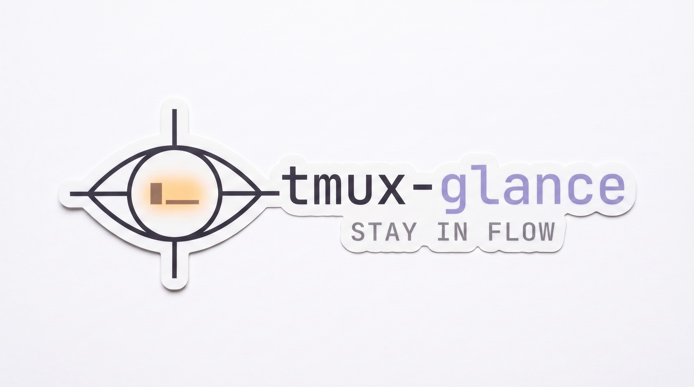
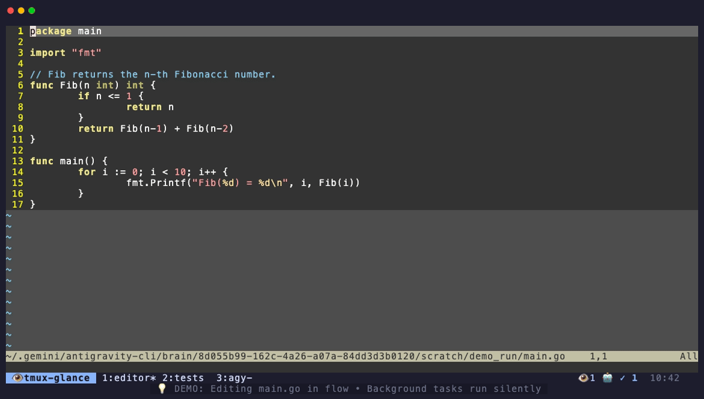

# 👁️ tmux-glance

<p align="center">
  
</p>

<p align="center">
  <strong>Ambient activity indicators, crystal-ball pane peering, and instant teleportation for tmux.</strong><br>
  <em>Stop speculative window hopping. Stay in flow.</em>
</p>

<p align="center">
  
</p>
<p align="center">
  <sub><em>💡 <strong>In Action:</strong> Status bar alerts trigger while in flow (<code>main.go</code>) → <code>prefix b</code> opens the Attention Hub viewfinder with live ANSI preview → <code>Enter</code> teleports into the agent prompt to approve.<br>(Note: The bottom <code>💡 DEMO</code> subtitle bar illustrates keypresses and narration for this demo; <code>tmux-glance</code> itself lives ambiently in your status bar).</em></sub>
</p>

---

## What is tmux-glance?

`tmux-glance` turns tmux into an ambient heads-up display for changes in background terminals, such as long-running builds, test suites, and autonomous AI agents:

- 🔮 **Crystal Ball Peering (`prefix b` / `prefix g`):** Pop open a floating viewfinder to peer into any pane across any session on your tmux server. Watch compiler output, log streams, or agent progress in real-time ANSI preview without leaving your current workspace.
- ⚡ **Instant Teleportation (`Enter`):** When something needs your hands, hit `Enter` in the viewfinder to teleport straight into that session, window, and pane.
- 👁️ **Glanceable Status Bar Icons:** Ambient indicators (`🚨 1`, `👁️ 2`, `🤖 ⏳ 1`, `🤖 ⚡ 2`) sit quietly in your status bar. If it's quiet, you stay in flow; if a build fails or an agent is blocked waiting for you, you know immediately.
- 🎯 **One-Key Vigil Watches (`prefix v`):** Slap a sentinel on _any_ shell command or long compile. Switch away, and your status bar will flash `🚨 1` the exact moment new output appears.
  - _Want custom trigger logic or noise filtering for a specific application?_ Write your own [**Sentinel plugin**](#pluggable-sentinels) in a few lines of bash! Sentinels can classify custom states (`waiting`, `running`, `idle`) and normalize spinners or streaming thought lines so you only get alerted when it truly matters.

---

## The Problem: Speculative Window Hopping

In modern development workflows, we juggle multiple long-running terminal tasks:

- Autonomous AI coding agents (Antigravity, Claude Code, Aider) executing multi-step refactors.
- Compilation and testing (`cargo build`, `nix build`, `bazel`, `go test`).
- Tail logs, database migrations, and remote test runners.

Without ambient awareness, developers suffer from **speculative window hopping**—repeatedly cycling `prefix n`, `prefix p`, or jumping between sessions just to check:

> _"Did my build finish? Is the agent waiting for confirmation? Did that background test fail?"_

Every speculative jump breaks concentration.

## The Solution: Ambient Glanceability

`tmux-glance` embeds minimal, ambient telemetry directly into your tmux status bar:

```
[10:42]  🚨 1  👁️ 1  🤖 ⏳ 1  🤖 ⚡ 2
```

If the status bar is quiet, you stay focused on your active code. Badges follow a **User-First Domain Clustering** order (manual user vigils lead, followed by autonomous background agents):

- `🚨 1` — A pane under **Vigil** just printed new terminal output!
- `👁️ 1` — Panes actively being watched under Vigil in the background.
- `🤖 ⏳ 1` — A background agent is blocked **waiting for confirmation**.
- `🤖 ⚡ 2` — Background agents actively running.
- `🤖 ✓ 1` — An agent completed its task or updated its output.

With one keystroke (`prefix b`), open the **Attention Hub** popup to see only the tasks that need you, inspect their output with live ANSI preview, and press `Enter` to jump straight to the pane.

---

## Default Keybindings

`tmux-glance` registers only three non-disruptive Tier 1 keychords by default, never hijacking built-in tmux keys:

| Key | Action | Description |
| :--- | :--- | :--- |
| `prefix b` | **Attention Hub** | Floating viewfinder filtered strictly to tasks that need you (`🚨 Alert`, `🤖 ⏳ Waiting`). |
| `prefix g` | **Fleet View** | Server-wide dashboard showing all active agents and watched processes. |
| `prefix v` | **Toggle Vigil** | Slap a watchful sentinel on the current pane (or release it). |

> **Inside the Viewfinder Popup:**
> * `Ctrl-b` — Toggle instantly between the filtered Attention Hub and full Fleet View.
> * `Ctrl-s` — Switch to the Sessionizer to search and jump between active tmux sessions with ambient status badges.
> * `Enter` — Teleport straight into the selected pane or session.
> * `Esc` — Close the popup without jumping.

---

## Key Features

- **Intelligent Thought Normalizer:** AI agents animate braille spinners (`[⠋⠙⠹...][⣾⣽⣻⢿]`) and stream thoughts in-place. `tmux-glance` normalizes and filters out transient thought streams, ensuring unread alerts only trigger on real actions or tool completions.
- **Auto-Acknowledgment on Focus:** No tedious alert dismissal. Simply switching focus into a pane (`pane-focus-in` hook) acknowledges and clears its notification.
- **Zero Polling Lag & Atomic Locking:** State updates use file locking (`.lock`) with sub-millisecond execution, avoiding status bar micro-stutters or race conditions.
- **Active Real-Time Tailing:** The interactive viewer actively streams and updates the focused pane's live buffer in real-time, letting you watch agent output, compiler logs, and thinking progress without needing to navigate or reload.
- **Pluggable Sentinels:** Clean provider interface decouples the core multiplexer from specific agent TUIs.

---

## Prerequisites

- **tmux ≥ 3.2**: Required for floating popup windows (`display-popup`).
- **fzf**: Required for interactive picker and terminal live previews.
- Standard POSIX utilities: `bash`, `coreutils` (`awk`, `grep`, `sed`, `md5` or `md5sum`).

---

## Installation

### Option 1: Nix Flake + Home Manager (Recommended)

Add `tmux-glance` to your `flake.nix` inputs:

```nix
inputs.tmux-glance.url = "github:mhutchinson/tmux-glance";
```

Enable the module in your Home Manager configuration:

```nix
imports = [ inputs.tmux-glance.homeManagerModules.default ];

programs.tmux-glance.enable = true;
```

Then add ambient telemetry to your status bar in your tmux config:

```tmux
set -g status-right '#(tmux-glance status) %H:%M '
```

---

### Option 2: Tmux Plugin Manager (TPM)

Add `tmux-glance` to your plugins in `~/.tmux.conf`:

```tmux
set -g @plugin 'mhutchinson/tmux-glance'
set -g status-right '#(tmux-glance status) %H:%M '
```

Press `prefix + I` to fetch the plugin and activate.

---

### Option 3: Manual Git Clone

1. Clone the repository:

   ```bash
   git clone https://github.com/mhutchinson/tmux-glance ~/.tmux-glance
   ```

2. Add the automated loader to `~/.tmux.conf`:

   ```tmux
   run-shell ~/.tmux-glance/glance.tmux
   set -g status-right '#(~/.tmux-glance/bin/tmux-glance status) %H:%M '
   ```

3. Reload your tmux configuration:

   ```bash
   tmux source-file ~/.tmux.conf
   ```

---

### Option 4: Standalone Nix Profile (Without Home Manager)

```bash
nix profile install github:mhutchinson/tmux-glance
```

Add to `~/.tmux.conf`:

```tmux
bind-key g display-popup -E -w 85% -h 75% "tmux-glance list-all"
bind-key b display-popup -E -w 85% -h 75% "tmux-glance list"
bind-key v run-shell "tmux-glance toggle-vigil"
set-hook -g pane-focus-in "run-shell 'tmux-glance on-focus #{pane_id}'"
set -g status-right '#(tmux-glance status) %H:%M '
```

---

## Verifying Your Installation

1. **Check the CLI:**

   ```bash
   tmux-glance status
   ```

   _(Outputs nothing if all background panes are quiet, or formatted badges if agents are active)._

2. **Test Keybindings:**
   - Press `prefix + g`: The **Glance Fleet View** popup should appear.
   - Press `prefix + b`: The **Attention Hub** popup should appear.
   - Press `prefix + v`: You should see a status message: `👁️ Vigil active: ...` (press again to release).

---

## Pluggable Sentinels

`tmux-glance` uses modular Sentinels to inspect different agent TUIs and processes. Sentinels live in `sentinels/` or your personal config directory `~/.config/tmux-glance/sentinels/`.

### The Sentinel Contract

To add support for a new tool (e.g. Claude Code, Aider, or a custom build tool), create a shell script:

```bash
#!/usr/bin/env bash

# 1. Suggested default commands for the routing table
sentinel_myagent_default_commands=("myagent" "myagent-cli")

# 2. Classifier: return "state\tlabel"
#    Available states: waiting | running | done | idle
sentinel_myagent_classify() {
    local pane_id="$1" path="$2" cmd="$3"
    local tail_text
    tail_text=$(tmux capture-pane -p -t "$pane_id" 2>/dev/null | tail -n 4)

    if [[ "$tail_text" =~ "Permission required" ]]; then
        printf "waiting\tpermission required in %s\n" "$(basename "$path")"
    elif [[ "$tail_text" =~ "Working..." ]]; then
        printf "running\trunning in %s\n" "$(basename "$path")"
    else
        printf "idle\tidle in %s\n" "$(basename "$path")"
    fi
}

# 3. Fingerprint: return normalized hash of screen buffer
sentinel_myagent_fingerprint() {
    local pane_id="$1"
    tmux capture-pane -p -t "$pane_id" 2>/dev/null \
        | grep -vE '^[[:space:]]*Progress: [0-9]+%' \
        | md5sum | cut -d' ' -f1
}
```

Drop it in `~/.config/tmux-glance/sentinels/myagent.sh` and it will be loaded automatically!

---

## Advanced Configuration

### 1. Custom Keybindings & Popup Dimensions

#### In Home Manager (`home.nix`):

```nix
programs.tmux-glance = {
  enable = true;

  # Custom keybindings (defaults: g, b, v)
  keybindings = {
    glance = "g"; # prefix + g: Server-wide Fleet View
    hub = "b";    # prefix + b: Attention Hub
    vigil = "v";  # prefix + v: Toggle Vigil on current pane
  };

  # Custom popup window dimensions (defaults: 85% / 75%)
  popup = {
    width = "85%";
    height = "75%";
  };
};
```

#### In `~/.tmux.conf` (TPM / Manual):

```tmux
# Custom keybindings (defaults: g, b, v)
set -g @glance_key 'g'
set -g @glance_hub_key 'b'
set -g @glance_vigil_key 'v'

# Custom popup window dimensions (defaults: 85% / 75%)
set -g @glance_popup_width '85%'
set -g @glance_popup_height '75%'
```

---

### 2. Command Routing & Disabling Sentinels

`tmux-glance` decouples sentinel implementations from command names through an **$O(1)$ Command Routing Table**.

If you have a binary with a colliding name (a doppelgänger CLI) or want to ignore an upstream sentinel, you can configure routes and disables with zero code changes:

#### In Home Manager (`home.nix`):

```nix
programs.tmux-glance = {
  enable = true;

  # Completely disable specific sentinels:
  disabledSentinels = [ "claude" "aider" ];

  # Command routing table overrides:
  routes = {
    # Resolve doppelgänger: force 'chat' to be treated as a normal shell
    "chat" = "generic";

    # Route custom wrappers or binary names to a sentinel:
    "my-internal-agent" = "antigravity";
  };
};
```

#### In `~/.tmux.conf` (TPM / Manual):

```tmux
# Disable specific sentinels:
set -g @glance_disabled_sentinels 'claude,aider'

# Command route overrides: <command>=<sentinel>
set -g @glance_routes 'chat=generic,my-internal-agent=antigravity'
```

---

## Architecture

For deep dives into data flow, screen fingerprinting, state files, and race condition prevention, refer to [DESIGN.md](DESIGN.md).

---

## Development & Contributing

The repository includes a convenient `Justfile` for local development and CI:

```bash
# List all recipes
just

# Run the unit and integration test suite
just test

# Run Nix flake checks (builds package + runs sandbox tests)
just check

# Run ShellCheck across all scripts
just lint

# Run all local CI verification checks (lint, test, check)
just ci

# Check GitHub Actions, PRs, and Issues
just actions
just gh-prs
just gh-issues
```

---

## 🗺️ Milestones & Roadmap

### Completed Milestones

- [x] **v0.1: Pinned Tmux Bookmarks** — Basic pane pinning, persistent state, and fuzzy jumping via floating popup.
- [x] **v0.2: Autonomous Agent Detection** — Background scraping of agent TUIs, heuristic state classification (`waiting`, `running`, `idle`), and ANSI preview.
- [x] **v0.3: Dynamic Vigil Watches** — Output diffing and hashing for arbitrary shell commands; automatic promotion of background watches (`👁️`) to alerts (`🚨`) with focus auto-acknowledgment (`pane-focus-in`).
- [x] **v0.4: Standalone Flake & Pluggable Sentinels** — Standalone flake with Apache 2.0 license, modular sentinels (`antigravity`, `generic`), thinking spinner normalizer, $O(1)$ command routing table (`routes`), Home Manager module, and cross-platform GitHub Actions CI.
- [x] **v0.5: Active Real-Time Tailing & Viewfinder Pinning** — Real-time 500ms diff-hashing preview tailing and bottom viewport locking (`:follow`) for live prompt and build tracking.
- [x] **v0.6: In-Dashboard Sessionizer (`Ctrl-s`)** — Search and switch tmux sessions directly within the Glance dashboard, complete with ambient status badge summaries (`🚨 1`, `🤖 ⏳ 1`, `👁️ 2`) representing the state of each workspace.

### Upcoming Roadmap

- [ ] **v0.7: Hierarchy Telescoping (`Ctrl-w` / `Ctrl-p`)** — Expand picker scope to search across all open windows (`Ctrl-w`) or all active panes (`Ctrl-p`) across the server, creating a unified navigation hub.
- [ ] **v0.8: Jump History & Jumplist Backtracking (`Ctrl-h` / Undo-Redo)** — Dual Back/Forward jump stack for seamless pane navigation. Full in-viewer history stack (`Ctrl-h`), with opt-in instant undo/redo chords (`prefix C-z` / `prefix C-y` or repeatable `prefix -r u` / `U`) to jump straight back without opening a menu.
- [ ] **v0.9: Global Agent Quotas & Saturation Gauges** — Sentinel capacity/quota hook (`sentinel_<name>_gauge`). Kept quiet in `status-right` until capacity drops below 20% (escalating to warning colors), always visible in the dashboard header, strictly backed by asynchronous local cache.
- [ ] **v0.10: Quickfix Attention Cycling & Queue HUD (`prefix -r ]` / `prefix -r [`)** — Vim quickfix-style cycling directly through panes contributing active status icons. Opt-in repeatable `[` and `]` navigation with a docked mini-queue HUD / status overlay and dwell-time auto-ack suppression to avoid dismissing alerts while whizzing past.

---

## License

[Apache 2.0](LICENSE) © 2026 Martin Hutchinson
